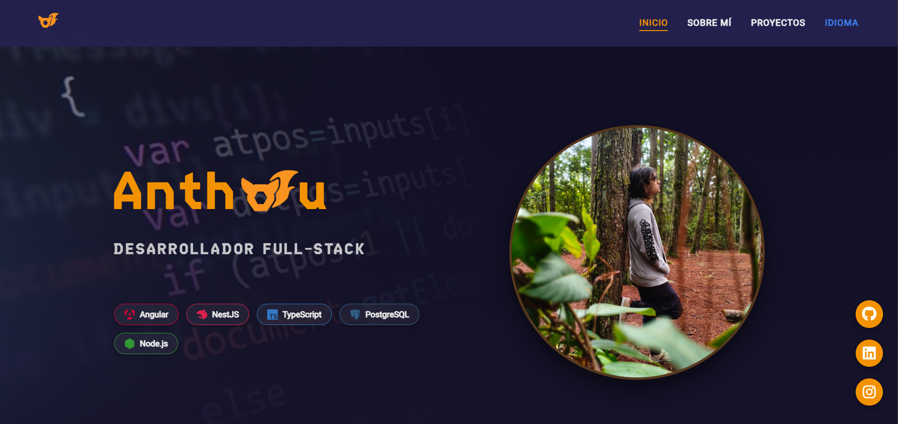
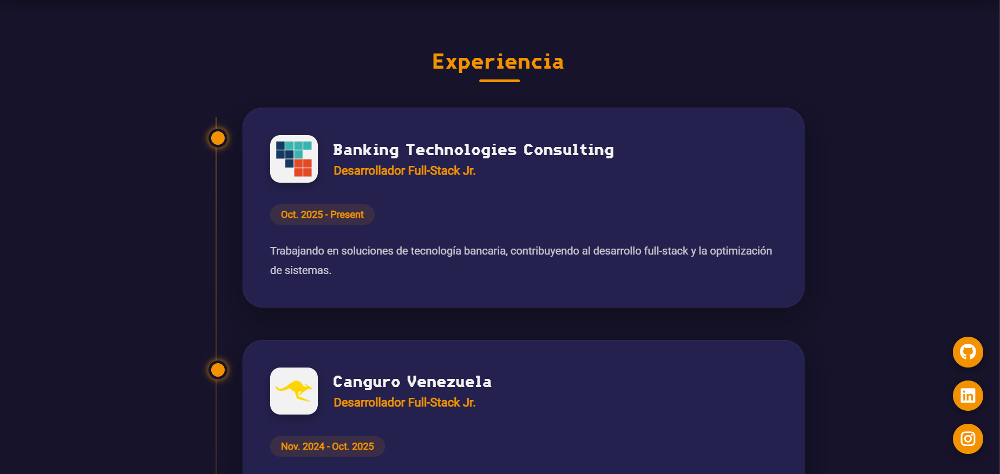
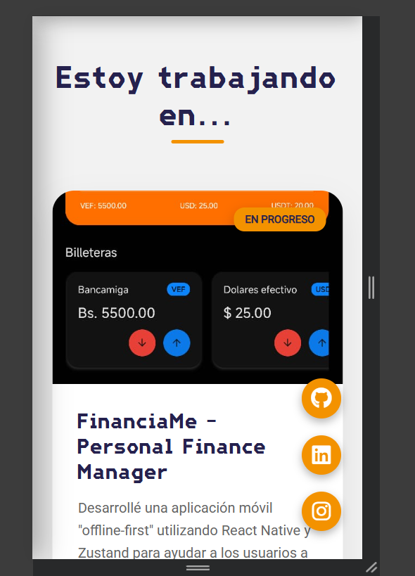
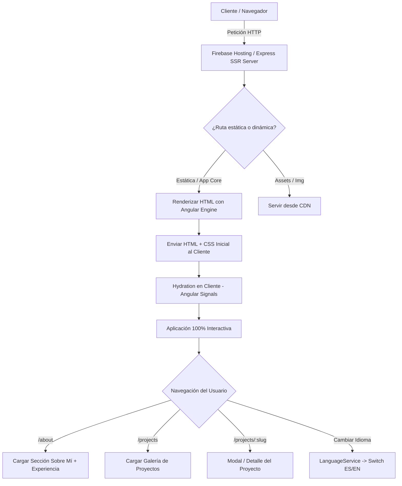
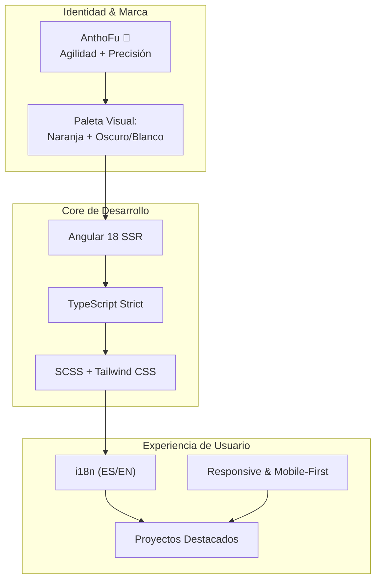

# AnthoFu Portfolio v2 - Personal Software Engineering Showcase

<p align="center">
    
</p>

> Un portafolio profesional moderno e interactivo desarrollado con Angular 18 y Server-Side Rendering (SSR). Diseñado para presentar proyectos de software de alto impacto, experiencia técnica y una arquitectura limpia, metódica y orientada al detalle.

---

- **Autor: [AnthoFu🦊](https://github.com/AnthoFu)** (Anthony Fuentes)
- **Diseño en Figma: [Ver Prototipo en Figma](https://www.figma.com/design/6E5uyHKu4u2WuDSmga2rOh/PortFolio?node-id=0-1&t=cGun2Sy0UPoKR1fL-1)**
- **Última actualización: 27 de marzo de 2026**

---

## 🦊 Filosofía & Marca Personal

Mi marca personal se basa en **la limpieza, la eficiencia y el diseño funcional**.

* **El Zorro Geométrico:** Simboliza agilidad e inteligencia para resolver problemas complejos de ingeniería de software.
* **Geometría & Tipografía Angular:** El hexágono central representa la **estructura, la lógica y la precisión técnica** en cada línea de código.
* **Paleta de Colores:** El **naranja** proyecta creatividad y energía, contrastado con tonos oscuros y blancos que aportan **claridad y elegancia profesional**.

> *"Un procrastinador más en este mundo que anhela la perfección y castiga a aquellos que fallan intentando conseguirla."* — AnthoFu

---

## 🚀 Funcionalidades Clave

- **⚡ Server-Side Rendering (SSR):** Optimización total de tiempos de carga inicial y SEO avanzado mediante `@angular/ssr` y Express.
- **🌐 Sistema de Internacionalización (i18n):** Alternancia fluida y dinámica entre Español (`ES`) e Inglés (`EN`) con estado persistente.
- **🎨 Enfoque Híbrido de Estilos (SCSS + Tailwind CSS):** Arquitectura visual limpia combinando clases de utilidad con estilos globales y animaciones CSS avanzadas.
- **📱 Arquitectura Mobile-First & Responsiva:** Interfaz totalmente adaptada a cualquier tamaño de pantalla, con navegación fluida y menús laterales táctiles.
- **📁 Galería & Modal de Proyectos Dinámico:** Exploración interactiva de proyectos con filtrado por año, estado, modal detallado y carrusel de capturas de alta definición.
- **💼 Timeline de Experiencia Profesional:** Sección dedicada a la trayectoria laboral (desarrollo web, Odoo 17 ERP, AWS Lambda, automatizaciones).
- **📬 Acceso Directo de Contacto (Floating Action):** Botones flotantes interactivos para contacto directo vía LinkedIn, GitHub y Correo Electrónico.
- **🔥 Despliegue Automatizado:** Configurado para producción inmediata sobre **Firebase Hosting**.

---

## 📸 Capturas de Pantalla

<table align="center">
  <tr>
    <td align="center"><strong>Inicio (PC)</strong><br></td>
    <td align="center"><strong>Experiencia</strong><br></td>
  </tr>
  <tr>
    <td align="center" colspan="2"><strong>Vista Móvil & Proyectos</strong><br></td>
  </tr>
</table>

---

## 🛠️ Stack de Tecnología

### Core Framework & Frontend
- **Framework:** [Angular 18](https://angular.dev/) (Signals, Standalone Components, Dynamic Routes)
- **Lenguaje:** [TypeScript 5.5](https://www.typescriptlang.org/)
- **Gestión de Estado & Reactividad:** Angular Signals & RxJS
- **Estilos:** SCSS & [Tailwind CSS](https://tailwindcss.com/)

### Backend, SSR & Nube
- **Engine SSR:** `@angular/ssr` + [Express](https://expressjs.com/)
- **Hosting & Infraestructura:** [Firebase Hosting](https://firebase.google.com/)
- **Control de Versiones:** Git & GitHub

---

## 🌟 Proyectos Destacados en el Portafolio

Este portafolio reúne y exhibe los proyectos más significativos desarrollados por AnthoFu:

1. **[FinanciaMe Mobile App](https://github.com/AnthoFu/FinanciaMe):** Aplicación móvil offline-first de finanzas personales multimoneda (VES/USD/USDT) en React Native, Expo y Zustand.
2. **[AnthoFu Chatter (Teslo Shop)](https://github.com/AnthoFu/04-teslo-shop):** Chat en tiempo real con WebSockets (Socket.io), backend NestJS, TypeORM, PostgreSQL y JWT Auth.
3. **[Anthocito Discord Bot](https://github.com/anthofu/anthocito):** Bot multifuncional y modular desarrollado en TypeScript, Node.js y MongoDB/Mongoose.
4. **[AnthoFu's Fake Store](https://github.com/AnthoFu/Angular-17-Platzi):** Frontend e-commerce reactivo construido con Angular 17, Signals y FakeAPI.
5. **[UNEXCA Prototype Website](https://unexca-website.netlify.app):** Portal web institucional con consumo en tiempo real de la Meta API.

---

## ✨ Calidad de Código & Estándares

El proyecto está diseñado bajo principios de arquitectura limpia, modularidad de componentes y documentación extensiva.

### Scripts Útiles

- `npm start`: Inicia el servidor de desarrollo local con Angular CLI (`ng serve`).
- `npm run build`: Compila la aplicación para producción incluyendo Server-Side Rendering (SSR).
- `npm run serve:ssr:portfolio`: Ejecuta el servidor Node.js/Express SSR localmente.
- `npm run deploy`: Compila el proyecto y realiza el despliegue automático en Firebase Hosting.

---

## 🏁 Cómo Empezar

### Prerrequisitos

- [Node.js](https://nodejs.org/en/) (v18.18.0 o superior)
- [npm](https://www.npmjs.com/) (v9 o superior)
- [Angular CLI](https://angular.dev/tools/cli) (`npm install -g @angular/cli`)

### Instalación Local

1. **Clona el repositorio:**
   ```bash
   git clone https://github.com/AnthoFu/Portfolio.git
   ```
2. **Navega al directorio del proyecto:**
   ```bash
   cd Portfolio
   ```
3. **Instala las dependencias:**
   ```bash
   npm install
   ```
4. **Inicia el servidor de desarrollo:**
   ```bash
   npm start
   ```
5. **Abre tu navegador:**
   Navega a `http://localhost:4200/` para explorar el portafolio en tiempo real.

---

## 📊 Diagramas de Arquitectura & Flujo

### 1. Flujo de Navegación & SSR (Server-Side Rendering)



### 2. Estructura y Filosofía de Diseño



---

## 🤝 Contacto & Redes

- **GitHub:** [@AnthoFu](https://github.com/AnthoFu)
- **Correo Electrónico:** [anthony.fuentes2005@gmail.com](mailto:anthony.fuentes2005@gmail.com)
- **LinkedIn:** [Anthony Fuentes](https://www.linkedin.com/)

---

## 📄 Licencia

Este proyecto está bajo la Licencia **MIT**. Consulta el archivo [LICENSE](LICENSE) para más detalles.
